# advent2020
> The code is in a rough state

Solutions to the Advent of Code [2020](https://adventofcode.com/2020)

## Selected Visualizations

### `Day 3`

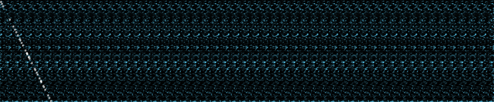
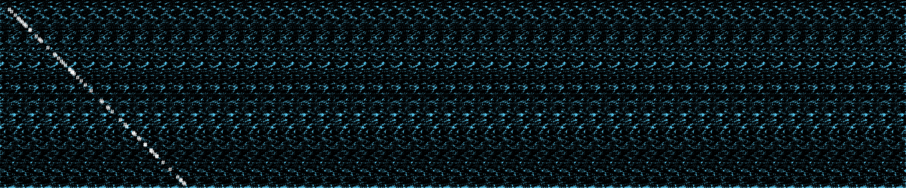
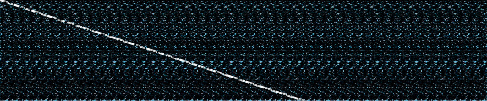
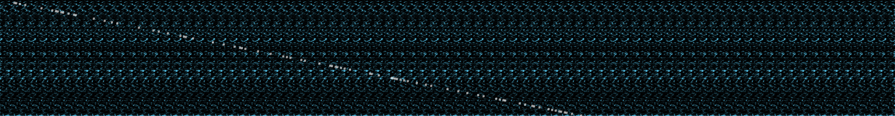
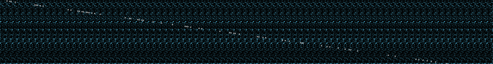

### `Day 6`

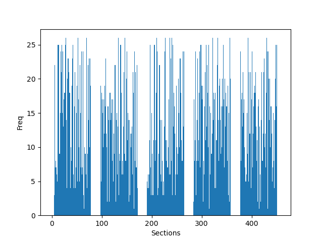
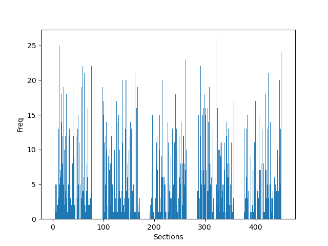

### `Day 7`

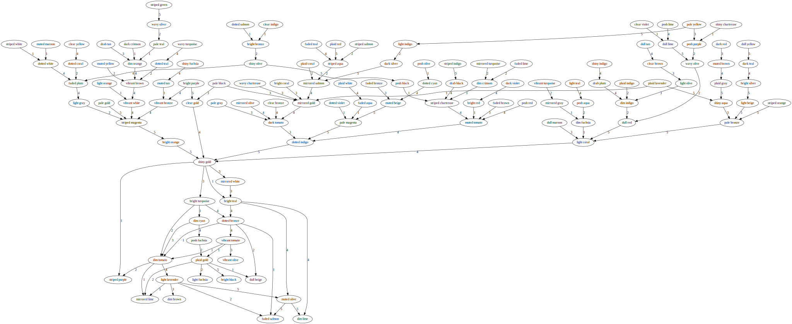

### `Day 9`

### `Day 11`

##### Part 1
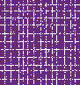

##### Part 2

### `Day 12`

##### Part 1

### `Day 17`

##### Part 1
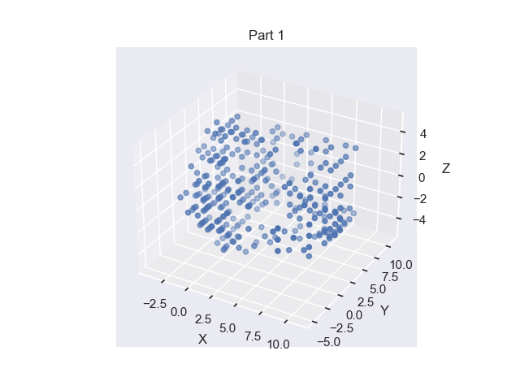

##### Part 2
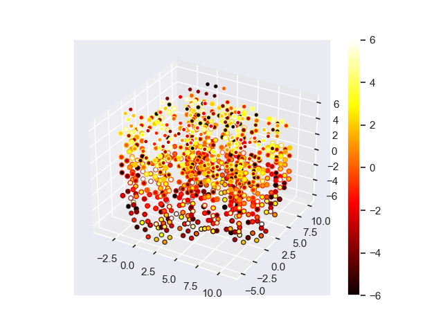

### `Day 24`

##### Part 1
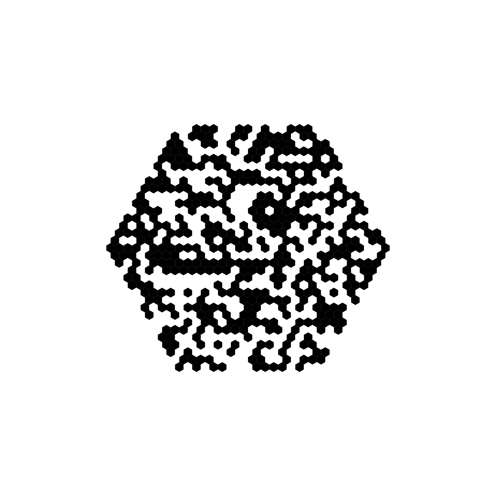

##### Part 2

