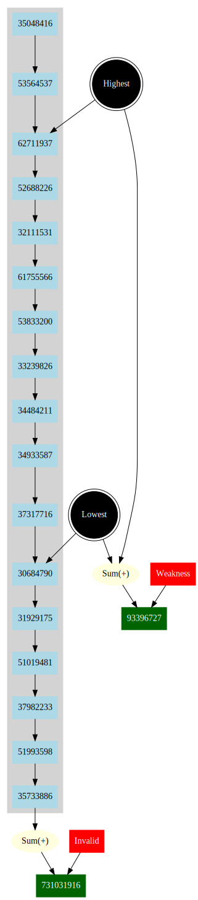

# advent2020
> The current state of codebase is in less than ideal form

Advent of Code 2020

## Selected Visualizations
### `Day 1`

### `Day 3`

### `Day 6`

### `Day 7`

### `Day 9`

### `Day 11`

##### Part 1

##### Part 2

### `Day 12`

##### Part 1

